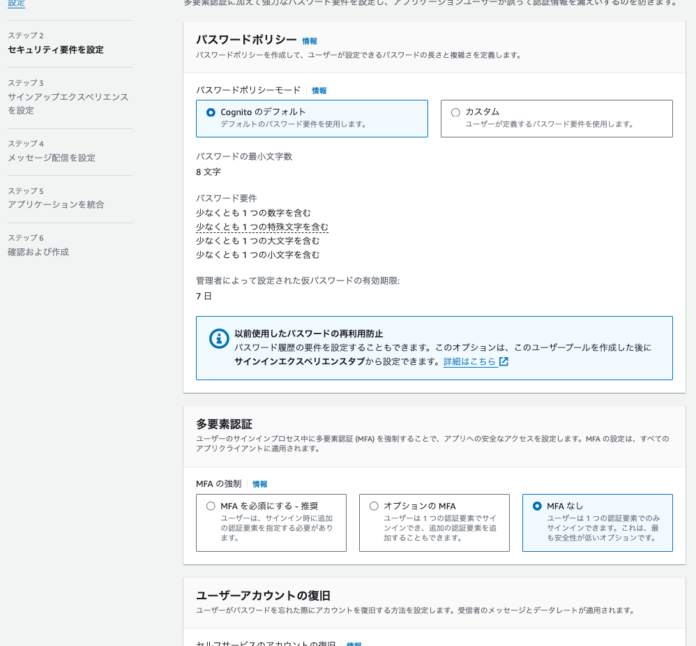
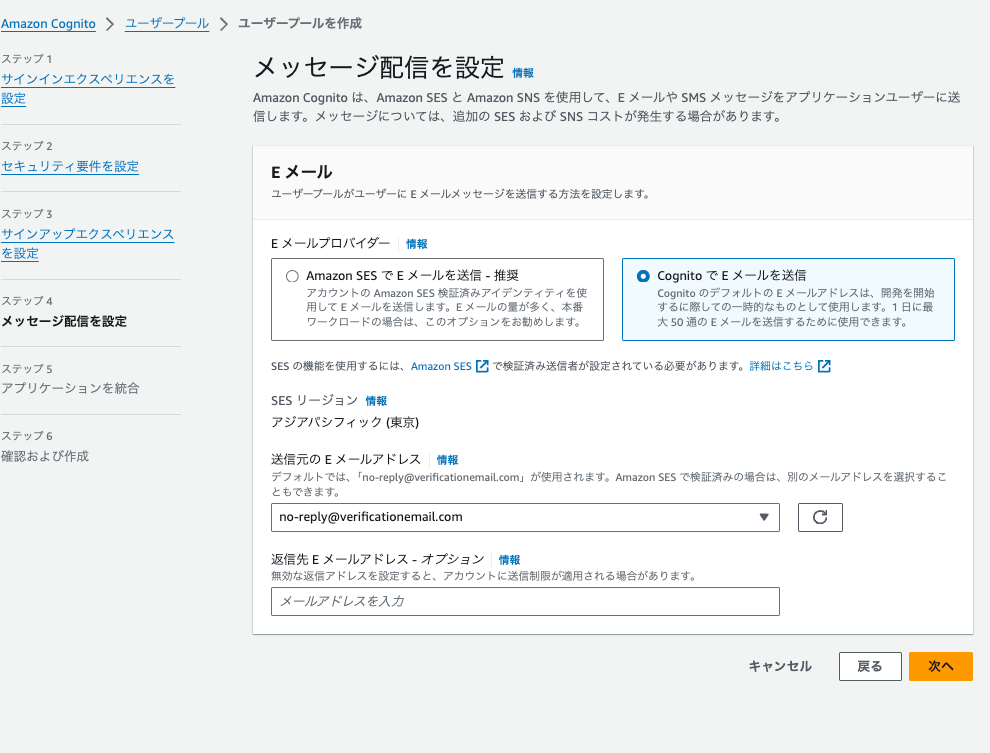

# Role-handling & AWS-SES

目次

- [今回のシステム概要図](#今回のシステム概要図)
- [cognitoの設定](#cognitoの設定)
- [sesの設定](#sesの設定)
- [備考](#備考)
- [参考](#参考)

# 今回のシステム概要図

 システム概要図

# cognitoの設定

 1. 特に別のIdPと連携しないなら、チェックなしで次に

 2. MFA認証は入れる方がおすすめ

 3. とりあえずエラーが出るのでCognitoの方を設定

 4. アプリケーションとの統合部分（やること多い）

- ホストされた認証ページにチュックを入れて、springsecurityのauthorize-urlからアクセスできるCognitoドメインの作成
- 秘密クライエントにチェックを入れて、シークレットの生成
- コールバックURIの登録
- スコープをopenIDで設定（できるだけ少ない情報にしたかった）
- 実際に取れそうなPrincipalは下記の添付

# sesの設定

 1. IDの作成

- ①のIDをクリック
- ②IDの作成をクリック

 2.ドメインor メールアドレスを登録

- ③今回の例は、Eメールをチェックして、アドレスを記入
- ④IDの作成をクリック

 3. 登録したメールの検証

- ⑤「検証保留中」になっているため、登録したメールアドレスに届いているメールで検証を進める。検証されると「検証済み」になる
- この検証を実施しないと、SESがメール送信できない。サンドボックスモードの場合は、受信メアドもこの検証処理が事前に必要

# 備考

# 参考
